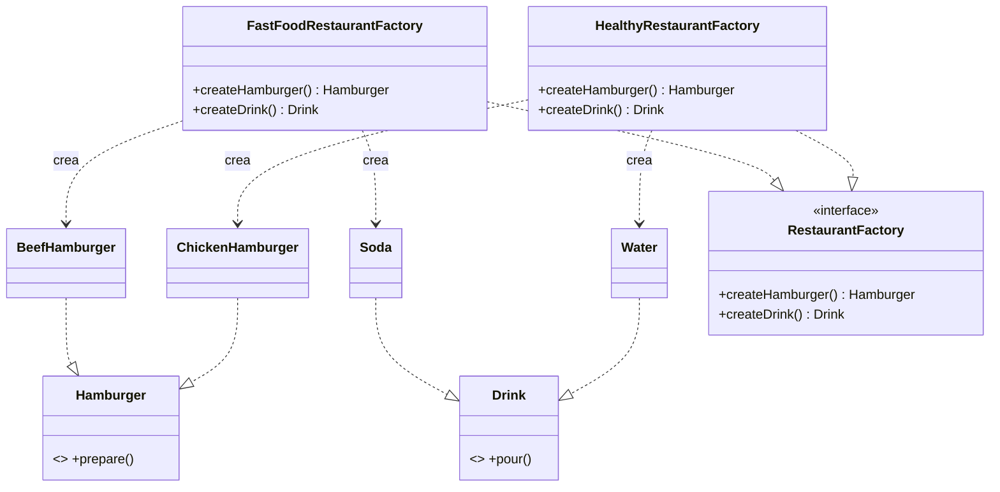
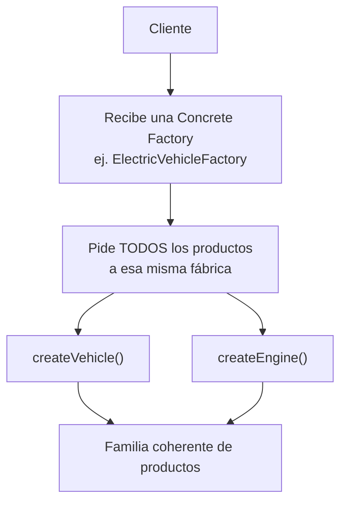

# Abstract Factory

> Requisito previo: si aún no tienes claro [Factory Method](factory-method.md), revísalo primero — Abstract Factory se apoya directamente en esa idea.

## 1. Abstract Factory en una frase

> Abstract Factory agrupa **varios Factory Methods relacionados** en una sola fábrica, para garantizar que los productos que crea siempre formen una **familia coherente** entre sí.

---

## 2. El problema

Ya sabes crear una hamburguesa sin conocer su clase concreta (Factory Method). Pero un pedido real no es solo una hamburguesa — también lleva una bebida. Y esa bebida **tiene que hacer juego** con el tipo de menú:

- Menú rápido → hamburguesa de res + gaseosa.
- Menú saludable → hamburguesa de pollo + agua.

Si creas cada producto con su propio Factory Method **independiente**:

```ts
function crearHamburguesa(modo: 'fastfood' | 'healthy'): Hamburger {
  return modo === 'fastfood' ? new BeefHamburger() : new ChickenHamburger();
}

function crearBebida(modo: 'fastfood' | 'healthy'): Drink {
  return modo === 'fastfood' ? new Soda() : new Water();
}

// en otro punto del código...
const hamburguesa = crearHamburguesa('fastfood');
const bebida = crearBebida('healthy'); // <- nadie detecta este error
```

Aparecen problemas nuevos, que Factory Method por sí solo no resuelve:

- **Nada garantiza que los productos combinen entre sí.** Aquí se coló una hamburguesa de res con agua "saludable" — un combo que no debería existir, y el compilador no se queja porque cada función es válida por separado.
- **El mismo criterio (`modo`) se repite** en cada función de creación (`crearHamburguesa`, `crearBebida`, y cada producto nuevo que agregues). Si mañana agregas `crearPostre()`, vuelves a escribir el mismo `if`/`switch`.
- **No hay un solo lugar que represente "todo el menú fastfood"** — está disperso en varias funciones que casualmente coinciden en el mismo parámetro.

El problema de fondo ya no es "qué clase concreta crear" (eso ya lo resuelve Factory Method) — es **mantener coherente un grupo de productos relacionados que deben crearse juntos**.

---

## 3. La idea de Abstract Factory

**Analogía:** comprar muebles para la sala.

Si compras un sofá de estilo moderno, una mesa victoriana y una lámpara industrial por separado, el resultado no combina. Una tienda de muebles seria te ofrece **catálogos completos por estilo**: "Línea Moderna" (sofá moderno + mesa moderna + lámpara moderna) o "Línea Victoriana" (sofá victoriano + mesa victoriana + lámpara victoriana). Eliges el catálogo una vez, y **todo lo que sale de ahí combina automáticamente**.

**Técnicamente**, Abstract Factory hace lo mismo: en vez de una función por producto, defines **una fábrica por familia** (`FastFoodRestaurantFactory`, `HealthyRestaurantFactory`), y esa fábrica agrupa **todos los métodos de creación relacionados** (`createHamburger()` + `createDrink()`). Eliges la fábrica una vez, y todo lo que produce ya es coherente entre sí — es imposible pedirle una hamburguesa de res y que te devuelva agua "saludable" por error, porque ambas salen de la misma fábrica `FastFoodRestaurantFactory`.

---

## 4. Estructura del patrón

| Participante | Rol | En el ejemplo |
|---|---|---|
| **Abstract Product A** | Interfaz de la primera familia de producto | `Hamburger` |
| **Abstract Product B** | Interfaz de la segunda familia de producto | `Drink` |
| **Concrete Product A1/A2** | Implementaciones concretas del producto A | `BeefHamburger`, `ChickenHamburger` |
| **Concrete Product B1/B2** | Implementaciones concretas del producto B | `Soda`, `Water` |
| **Abstract Factory** | Interfaz que declara un método de creación **por cada** producto de la familia | `RestaurantFactory` (`createHamburger()`, `createDrink()`) |
| **Concrete Factory 1/2** | Implementa todos los métodos de creación, garantizando una combinación coherente | `FastFoodRestaurantFactory`, `HealthyRestaurantFactory` |
| **Client** | Recibe una `Abstract Factory` y la usa sin saber qué familia concreta es | La función `main(factory: RestaurantFactory)` |

> **Diferencia clave con Factory Method:** ahí había **un** método fábrica (`createHamburger()`) en una sola clase. Aquí hay **varios** métodos fábrica (`createHamburger()` + `createDrink()`) agrupados en **una** interfaz, y cada `Concrete Factory` los implementa todos a la vez para asegurar que combinen.

---

## 5. Diagrama



**En palabras simples:**

Cliente → recibe una fábrica concreta (`FastFoodRestaurantFactory` o `HealthyRestaurantFactory`) → le pide **todos** los productos de la familia a esa misma fábrica → recibe una combinación garantizada-coherente, sin saber las clases concretas de nada.

---

## 6. Ejemplo básico

```ts
interface Hamburger { prepare(): void; }
interface Drink { pour(): void; }

class ChickenHamburger implements Hamburger {
  prepare() { console.log('Preparando hamburguesa de pollo'); }
}
class BeefHamburger implements Hamburger {
  prepare() { console.log('Preparando hamburguesa de res'); }
}

class Water implements Drink {
  pour() { console.log('Sirviendo un vaso de agua'); }
}
class Soda implements Drink {
  pour() { console.log('Sirviendo un vaso de gaseosa'); }
}

interface RestaurantFactory {
  createHamburger(): Hamburger;
  createDrink(): Drink;
}

class FastFoodRestaurantFactory implements RestaurantFactory {
  createHamburger(): Hamburger { return new BeefHamburger(); }
  createDrink(): Drink { return new Soda(); }
}

class HealthyRestaurantFactory implements RestaurantFactory {
  createHamburger(): Hamburger { return new ChickenHamburger(); }
  createDrink(): Drink { return new Water(); }
}

function main(factory: RestaurantFactory) {
  const hamburger = factory.createHamburger();
  const drink = factory.createDrink();

  hamburger.prepare();
  drink.pour();
}

main(new FastFoodRestaurantFactory());  // res + gaseosa
main(new HealthyRestaurantFactory());   // pollo + agua
```

**Qué ocurre en cada pieza:**

- `Hamburger` y `Drink` son **dos familias de producto distintas** — no una sola, como en Factory Method.
- `RestaurantFactory` agrupa **ambos** métodos de creación en una sola interfaz: quien implemente esta interfaz está obligado a saber crear los dos productos.
- `FastFoodRestaurantFactory` y `HealthyRestaurantFactory` son las únicas responsables de decidir **qué combinación** es válida — esa decisión ya no está repartida en dos funciones sueltas.
- `main()` recibe **una sola fábrica** y le pide todo a ella — es físicamente imposible que reciba una hamburguesa de una familia y una bebida de otra, porque ambas salen del mismo objeto `factory`.

---

## 7. Ejemplo más realista

Un caso de manufactura: ensamblar vehículos, donde el motor **debe** coincidir con el tipo de auto (un auto eléctrico no puede llevar un motor de combustión).

**Sin Abstract Factory**, el riesgo es exactamente el mismo que vimos en la sección 2:

```ts
function crearVehiculo(tipo: 'electric' | 'gas'): Vehicle {
  return tipo === 'electric' ? new ElectricCar() : new GasCar();
}

function crearMotor(tipo: 'electric' | 'gas'): Engine {
  return tipo === 'electric' ? new ElectricEngine() : new GasEngine();
}

// nada impide esto en tiempo de compilación ni de ejecución:
const auto = crearVehiculo('electric');
const motor = crearMotor('gas'); // auto eléctrico con motor de combustión
```

**Con Abstract Factory:**

```ts
interface Vehicle { assemble(): void; }
interface Engine { start(): void; }

class ElectricCar implements Vehicle {
  assemble() { console.log('Ensamblando un auto eléctrico'); }
}
class GasCar implements Vehicle {
  assemble() { console.log('Ensamblando un auto de combustión'); }
}

class ElectricEngine implements Engine {
  start() { console.log('Arrancando motor eléctrico'); }
}
class GasEngine implements Engine {
  start() { console.log('Arrancando motor de combustión'); }
}

interface VehicleFactory {
  createVehicle(): Vehicle;
  createEngine(): Engine;
}

class ElectricVehicleFactory implements VehicleFactory {
  createVehicle(): Vehicle { return new ElectricCar(); }
  createEngine(): Engine { return new ElectricEngine(); }
}

class GasVehicleFactory implements VehicleFactory {
  createVehicle(): Vehicle { return new GasCar(); }
  createEngine(): Engine { return new GasEngine(); }
}

function ensamblar(factory: VehicleFactory) {
  const vehicle = factory.createVehicle();
  const engine = factory.createEngine();

  vehicle.assemble();
  engine.start();
}

ensamblar(new ElectricVehicleFactory()); // siempre coherente: eléctrico + eléctrico
ensamblar(new GasVehicleFactory());      // siempre coherente: gas + gas
```

**Qué mejora:**

- Es **imposible por diseño** ensamblar un auto eléctrico con motor de combustión — no existe ninguna combinación de llamadas que lo permita, porque `ElectricVehicleFactory` solo sabe crear piezas eléctricas.
- Si agregas una tercera línea (`HybridVehicleFactory`), solo agregas **una clase nueva** que implementa `VehicleFactory` completa — el resto del código (`ensamblar()`) no cambia.
- La "regla de negocio" (qué combina con qué) vive en **un solo lugar por familia** (cada Concrete Factory), no dispersa en condicionales repetidos.

---

## 8. Flujo completo



**Paso a paso:**

1. El cliente recibe (o elige) **una** fábrica concreta que representa una familia completa.
2. Le pide, a esa **misma** fábrica, cada producto que necesite (`createVehicle()`, `createEngine()`, ...).
3. Cada producto que recibe pertenece a la misma familia, porque todos salieron del mismo objeto fábrica.
4. El cliente usa los productos a través de sus interfaces (`Vehicle`, `Engine`), sin conocer las clases concretas.

---

## 9. ¿Cuándo usar Abstract Factory?

- Necesitas crear **más de un producto relacionado** (2 o más) que deben ser consistentes entre sí.
- Quieres **evitar combinaciones inválidas** entre productos de distintas familias.
- Tu sistema debe poder **cambiar toda una familia de productos de una vez** (por ejemplo, cambiar de "modo eléctrico" a "modo gas" en todo el sistema, sin tocar la lógica cliente).
- Ya identificaste que necesitarías **varios Factory Methods coordinados** — Abstract Factory es la forma de agruparlos con garantías.

## 10. ¿Cuándo NO usar Abstract Factory?

Si solo tienes **un producto** (no una familia), Abstract Factory es Factory Method con pasos extra — usa Factory Method directamente.

```ts
// Un solo producto: no hay "familia" que coordinar, Factory Method basta
interface Hamburger { prepare(): void; }
```

Tampoco lo necesitas si los productos relacionados **nunca cambian de combinación** en tu aplicación (por ejemplo, siempre usas los mismos dos juntos, sin variantes) — ahí un objeto de configuración simple o un `Record` con los productos ya armados es más directo que crear toda la jerarquía de fábricas.

---

## 11. Ventajas y desventajas

| Ventajas | Desventajas |
|---|---|
| Garantiza que los productos relacionados sean compatibles entre sí | Requiere más clases/interfaces que Factory Method |
| Agregar una **familia nueva** completa (ej. `HybridVehicleFactory`) no toca código existente | Agregar un **producto nuevo** a la familia (ej. `createBattery()`) obliga a modificar **todas** las fábricas concretas existentes |
| Centraliza la "regla de combinación" en un solo lugar por familia | Puede ser sobreingeniería si solo hay un producto o una única combinación posible |
| El cliente queda totalmente desacoplado de las clases concretas | Más indirección: seguir el flujo requiere saltar entre varias interfaces |

---

## 12. Errores comunes

- **Usar Abstract Factory con un solo producto** — si no hay una segunda familia que coordinar, es Factory Method disfrazado con más código.
- **Mezclar productos de distintas fábricas manualmente** (`factoryA.createX()` con `factoryB.createY()`) — eso destruye la garantía de coherencia que es la razón de ser del patrón.
- **Confundir Abstract Factory con Factory Method**: Factory Method crea un producto; Abstract Factory crea una familia completa usando varios Factory Methods agrupados.
- **Olvidar que agregar un producto nuevo a la familia es costoso**: si agregas `createDessert()` a `RestaurantFactory`, tienes que volver a **todas** las fábricas concretas (`FastFoodRestaurantFactory`, `HealthyRestaurantFactory`, ...) a implementarlo. Esto es una limitación conocida del patrón, no un error de implementación.
- **Crear una jerarquía de fábricas cuando un simple objeto de configuración ya resolvía el problema** (ver sección 10).

---

## 13. Abstract Factory vs otros patrones creacionales

**Abstract Factory vs Factory Method** (ver [factory-method.md](factory-method.md)):

- **Factory Method**: una clase base, **un** método fábrica, crea **un** producto.
- **Abstract Factory**: una interfaz de fábrica con **varios** métodos fábrica, crea una **familia** de productos relacionados.
- En la práctica, cada método dentro de una Abstract Factory (`createHamburger()`, `createDrink()`) es, en sí mismo, un Factory Method. Abstract Factory = varios Factory Methods agrupados bajo una sola interfaz.

**Abstract Factory vs Builder** (ver [builder.md](builder.md)):

- **Builder** construye **un** objeto complejo, paso a paso, con muchas configuraciones opcionales.
- **Abstract Factory** construye **varios** objetos simples y relacionados, todos de una vez, garantizando que combinen.

```ts
// Abstract Factory: varios objetos relacionados, creados juntos
const hamburger = factory.createHamburger();
const drink = factory.createDrink();

// Builder: un solo objeto complejo, ensamblado en pasos
const computer = new ComputerBuilder().setCPU('i9').setRAM('32GB').build();
```

---

## 14. Resumen para estudiar

**Abstract Factory**

- **Problema** → Crear varios productos relacionados de forma independiente permite combinaciones inválidas y duplica la lógica de decisión.
- **Solución** → Agrupar todos los métodos de creación relacionados en una sola fábrica por familia.
- **Idea principal** → Una fábrica concreta = una familia completa y coherente de productos.
- **Cuándo usar** → Dos o más productos relacionados que deben combinar entre sí, con distintas variantes posibles de la familia completa.
- **Cuándo evitar** → Un solo producto (usa Factory Method), o combinaciones que nunca cambian (usa configuración simple).
- **Método característico** → una interfaz de fábrica con **varios** métodos `createX()`, todos implementados juntos por cada fábrica concreta.

### Preguntas de autoevaluación

1. ¿Qué garantiza Abstract Factory que Factory Method, usado varias veces por separado, no garantiza?
2. ¿Por qué agregar un producto nuevo a la familia (ej. `createDessert()`) es más costoso en Abstract Factory que agregar una familia nueva completa (ej. `VeganRestaurantFactory`)?
3. En el ejemplo de vehículos (sección 7), ¿por qué es imposible ensamblar un auto eléctrico con motor de combustión, incluso por error?
4. Da un ejemplo propio (no del documento) de dos o más productos que deban "combinar" entre sí — ¿qué pasaría si se crearan con Factory Methods independientes?
5. ¿Cuál es la relación entre Abstract Factory y Factory Method — son patrones competidores o uno se construye sobre el otro?
