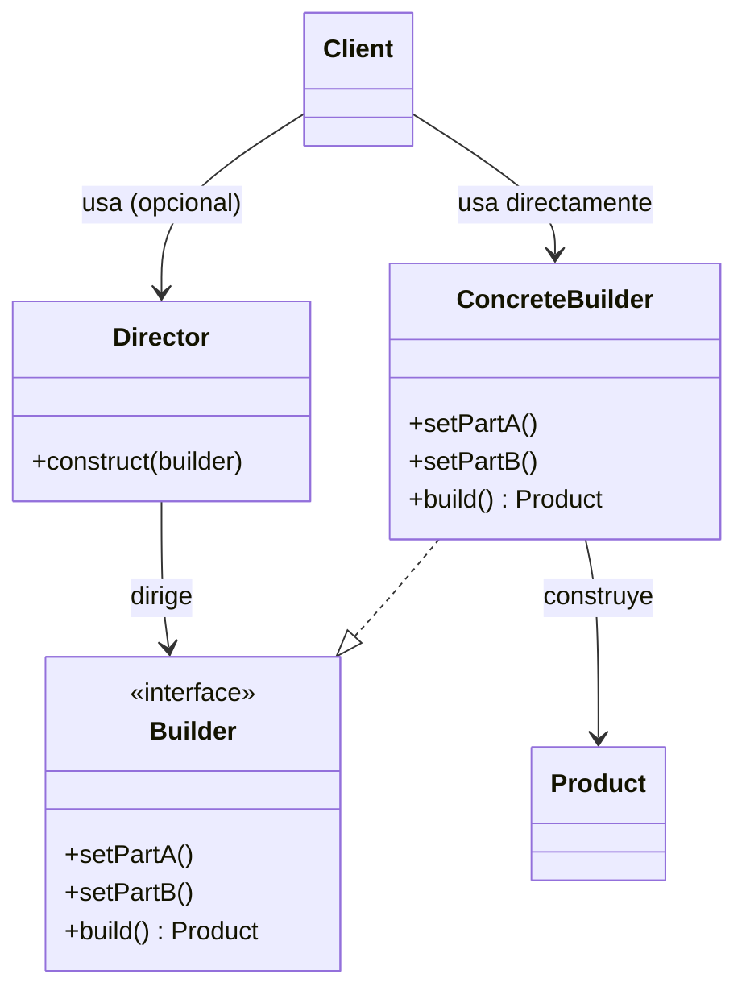
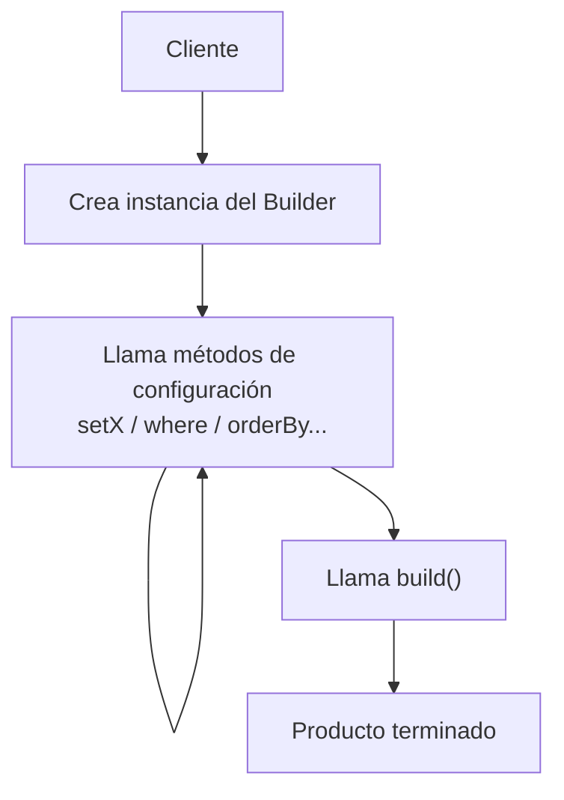

# Builder

## 1. Builder en una frase

> Builder separa **la construcción paso a paso** de un objeto complejo de **su representación final**, para que el mismo proceso de construcción pueda producir distintos resultados.

---

## 2. El problema

Imagina esta clase:

```ts
class Computer {
  constructor(
    public cpu: string,
    public ram: number,
    public storage: number,
    public hasGpu: boolean,
    public hasBluetooth: boolean,
    public hasWifi: boolean,
  ) {}
}

const gamingPC = new Computer('Intel i7', 32, 1000, true, false, true);
```

A simple vista funciona, pero aparecen varios problemas cuando este tipo de constructor crece:

- **Parámetros posicionales ilegibles**: al leer `new Computer('Intel i7', 32, 1000, true, false, true)` no sabes qué significa cada `true`/`false` sin ir a mirar la clase.
- **Parámetros opcionales combinados**: si `hasGpu` y `hasBluetooth` son opcionales, terminas con varios constructores sobrecargados o con `undefined` por todos lados (lo que se conoce como el **"telescoping constructor"**, un constructor que "crece como un telescopio" a medida que agregas parámetros).
- **Fácil cometer errores**: es muy fácil invertir el orden de dos parámetros del mismo tipo (por ejemplo, dos `boolean` seguidos) y el compilador no te avisa.
- **Objetos a medio construir**: si quieres crear variantes (PC básica, PC gamer, PC de oficina) terminas repitiendo llamadas casi idénticas al constructor, o creando múltiples constructores para cada combinación.

El problema de fondo no es *crear* el objeto, sino **construir un objeto complejo con muchas configuraciones posibles de forma legible y segura**.

---

## 3. La idea de Builder

**Analogía:** pedir una hamburguesa en un restaurante.

No dices "dame un objeto Hamburguesa con pan, carne 200g, dos quesos, sin cebolla, con tocino" en una sola frase confusa. En su lugar, vas paso a paso:

1. Eliges el pan.
2. Eliges la carne.
3. Agregas queso (opcional).
4. Agregas salsas (opcional).
5. Confirmas el pedido → recibes la hamburguesa terminada.

Cada paso es un método claro y con nombre. Nadie te obliga a decidir todo de una sola vez, y el orden de las decisiones no genera errores porque cada paso está identificado por su nombre, no por su posición.

**Técnicamente**, Builder aplica la misma idea: en lugar de un constructor con muchos parámetros, se ofrecen **métodos encadenados** (`setCPU()`, `setRAM()`, etc.) que configuran el objeto poco a poco, y un método final (`build()`) que entrega el producto ya construido.

---

## 4. Estructura del patrón

| Participante | Rol |
|---|---|
| **Product** | El objeto complejo que se está construyendo (ej. `Computer`). |
| **Builder** | Interfaz o clase que declara los pasos de construcción (`setCPU()`, `setRAM()`, `build()`). |
| **Concrete Builder** | Implementación concreta que sabe cómo construir una variante específica del producto. |
| **Director** *(opcional)* | Clase que conoce una "receta" — una secuencia predefinida de pasos del builder — para producir configuraciones estándar (ej. `buildGamingPC()`). |
| **Client** | Quien usa el builder (directamente o a través del Director) para obtener el producto final. |

> **Importante:** en TypeScript/JavaScript modernos, el `Director` casi siempre se omite. Como el propio cliente puede encadenar los métodos del builder directamente (`.setCPU().setRAM().build()`), no siempre hace falta una clase extra que orqueste la secuencia. El Director tiene más sentido cuando quieres **reutilizar la misma secuencia de pasos en varios lugares del código** sin repetirla.

---

## 5. Diagrama



**En palabras simples:**

Cliente → toma un Builder → llama a sus métodos paso a paso (con o sin ayuda de un Director) → cada método configura una parte del producto → al llamar `build()`, obtiene el Producto terminado.

---

## 6. Ejemplo básico

```ts
class Computer {
  public cpu: string = 'cpu no definida';
  public ram: string = 'ram no definida';
  public storage: string = 'almacenamiento no definido';
  public gpu?: string;
}

class ComputerBuilder {
  private computer = new Computer();

  setCPU(cpu: string): this {
    this.computer.cpu = cpu;
    return this;
  }

  setRAM(ram: string): this {
    this.computer.ram = ram;
    return this;
  }

  setStorage(storage: string): this {
    this.computer.storage = storage;
    return this;
  }

  setGPU(gpu: string): this {
    this.computer.gpu = gpu;
    return this;
  }

  build(): Computer {
    return this.computer;
  }
}

const gamingComputer = new ComputerBuilder()
  .setCPU('Intel i9')
  .setRAM('64GB')
  .setStorage('1TB M2')
  .setGPU('Nvidia RTX 5090')
  .build();
```

**Qué ocurre en cada pieza:**

- `Computer` es el **Product**: empieza con valores por defecto ("no definida"), así el objeto nunca queda en un estado indefinido (`undefined`) mientras se construye.
- `ComputerBuilder` guarda una instancia interna de `Computer` y la va modificando paso a paso.
- Cada `setX()` devuelve `this` — esto se llama **method chaining** (encadenamiento de métodos) y es lo que permite escribir `.setCPU().setRAM().build()` en una sola expresión fluida.
- `build()` es el método que **cierra** la construcción y entrega el producto terminado. Es la "señal" de que ya no se van a configurar más partes.
- No hay Director aquí: el cliente arma su propia secuencia de pasos. Para un caso tan simple, eso es suficiente.

---

## 7. Ejemplo más realista

Un caso común en backend: construir dinámicamente una consulta SQL a partir de condiciones que pueden o no estar presentes.

**Sin Builder**, el código tiende a verse así:

```ts
function findUsers(fields?: string[], age?: number, country?: string, order?: string, limit?: number) {
  let query = `SELECT ${fields ? fields.join(', ') : '*'} FROM users`;
  const conditions: string[] = [];
  if (age) conditions.push(`age > ${age}`);
  if (country) conditions.push(`country = '${country}'`);
  if (conditions.length) query += ` WHERE ${conditions.join(' AND ')}`;
  if (order) query += ` ORDER BY ${order}`;
  if (limit) query += ` LIMIT ${limit}`;
  return query;
}
```

**Problemas de este enfoque:**

- La firma de la función crece cada vez que se necesita un filtro nuevo.
- Es difícil reutilizar partes de la lógica (por ejemplo, agregar dos condiciones `WHERE`).
- Mezclar todos los `if` en una sola función hace que sea difícil de leer y de testear en partes aisladas.

**Con Builder:**

```ts
class QueryBuilder {
  private fields: string[] = [];
  private conditions: string[] = [];
  private orderFields: string[] = [];
  private limitCount?: number;

  constructor(private table: string) {}

  select(...fields: string[]): this {
    this.fields = fields;
    return this;
  }

  where(condition: string): this {
    this.conditions.push(condition);
    return this;
  }

  orderBy(field: string, direction: 'ASC' | 'DESC' = 'ASC'): this {
    this.orderFields.push(`${field} ${direction}`);
    return this;
  }

  limit(count: number): this {
    this.limitCount = count;
    return this;
  }

  build(): string {
    const fields = this.fields.length ? this.fields.join(', ') : '*';
    let query = `SELECT ${fields} FROM ${this.table}`;

    if (this.conditions.length) query += ` WHERE ${this.conditions.join(' AND ')}`;
    if (this.orderFields.length) query += ` ORDER BY ${this.orderFields.join(', ')}`;
    if (this.limitCount) query += ` LIMIT ${this.limitCount}`;

    return query;
  }
}

const usersQuery = new QueryBuilder('users')
  .select('id', 'name', 'email')
  .where('age > 18')
  .where("country = 'CRI'")
  .orderBy('name')
  .limit(10)
  .build();
```

**Qué mejora:**

- Cada condición (`where`, `orderBy`, `limit`) es **opcional e independiente**: solo llamas los métodos que necesitas.
- Puedes llamar `.where()` varias veces para ir agregando condiciones, algo casi imposible de expresar con parámetros de función.
- La consulta se lee casi como una oración: "de `users`, selecciona esto, donde esto, ordenado por esto, limitado a esto".
- Es fácil de extender: agregar un nuevo tipo de filtro es agregar un método nuevo, sin tocar la firma de nada existente.

---

## 8. Flujo completo



**Paso a paso:**

1. El cliente crea una instancia del builder (`new ComputerBuilder()` / `new QueryBuilder('users')`).
2. Llama, en el orden que necesite, solo los métodos de configuración que le interesan.
3. Cada método modifica el estado interno del builder y devuelve `this`, permitiendo encadenar el siguiente paso.
4. Cuando ya configuró todo lo necesario, llama `build()`.
5. `build()` devuelve el **Product** final, ya listo para usarse.

---

## 9. ¿Cuándo usar Builder?

- El objeto tiene **muchos parámetros**, sobre todo si varios son del mismo tipo (riesgo de confundir el orden).
- Existen **muchos parámetros opcionales** y no todas las combinaciones tienen sentido siempre.
- El mismo tipo de objeto necesita **configuraciones distintas** (PC básica vs. PC gamer, request simple vs. request con headers/auth/body).
- La construcción requiere **varios pasos** que no siempre se ejecutan en el mismo orden.
- Quieres mejorar la **legibilidad** de la creación de objetos frente a un constructor largo.

## 10. ¿Cuándo NO usar Builder?

Si el objeto es simple y tiene pocos parámetros obligatorios, Builder es sobreingeniería:

```ts
class User {
  constructor(public name: string, public email: string) {}
}

new User('Ana', 'ana@mail.com'); // Esto ya es perfectamente legible
```

Crear un `UserBuilder` aquí solo agrega más código (una clase extra, más métodos, más indirección) sin resolver ningún problema real. **Regla práctica:** si el constructor ya es fácil de leer y no tiene parámetros opcionales confusos, no necesitas Builder.

---

## 11. Ventajas y desventajas

| Ventajas | Desventajas |
|---|---|
| Mejora la legibilidad al crear objetos complejos | Agrega clases/código adicional |
| Evita constructores con muchos parámetros | Puede ser innecesario para objetos simples |
| Permite construir distintas variantes con el mismo proceso | Si se abusa, dificulta ver "de un vistazo" todos los campos del objeto |
| Facilita hacer campos opcionales sin combinaciones de constructores | El objeto puede quedar en estado inválido si `build()` no valida nada |
| Permite reutilizar pasos comunes (con Director) | Puede tentar a meter lógica de negocio donde no corresponde |

---

## 12. Errores comunes

- **Usar Builder para objetos triviales** (2-3 parámetros obligatorios, sin variantes): agrega complejidad sin necesidad.
- **Confundir Builder con Factory**: Factory decide *qué clase/objeto instanciar*; Builder decide *cómo ensamblar, paso a paso, un objeto ya sabido*. No resuelven el mismo problema.
- **Permitir `build()` sin validar el estado**: si campos obligatorios pueden quedar sin definir y `build()` no lo valida, el patrón termina generando objetos inválidos igual que el problema original.
- **Meter lógica de negocio en el Builder**: el builder debe ensamblar datos, no decidir reglas de negocio (por ejemplo, calcular precios, aplicar descuentos). Eso pertenece a otra capa.
- **Crear una jerarquía completa (Builder + Director + varios ConcreteBuilders) cuando un solo builder simple ya resolvía el problema.**

---

## 13. Builder vs Factory Method

La diferencia clave:

- **Factory Method** responde: **¿qué objeto crear?** (por ejemplo, según el tipo, crear un `CarroDeportivo` o un `CarroFamiliar`, cada uno con su propia clase).
- **Builder** responde: **¿cómo construir, paso a paso, un objeto complejo?** (el objeto suele ser del mismo tipo, pero con configuraciones distintas).

**Ejemplo:**

```ts
// Factory Method: decide QUÉ clase instanciar
function createVehicle(type: 'car' | 'motorcycle'): Vehicle {
  if (type === 'car') return new Car();
  return new Motorcycle();
}

// Builder: decide CÓMO ensamblar un mismo tipo de objeto complejo
const car = new CarBuilder()
  .setEngine('V8')
  .setColor('rojo')
  .setSunroof(true)
  .build();
```

Incluso se pueden combinar: un Factory Method podría devolver el `Builder` adecuado según el tipo de producto que se necesite construir.

---

## 14. Resumen para estudiar

**Builder**

- **Problema** → Constructores con demasiados parámetros (obligatorios/opcionales) que son difíciles de leer y propensos a errores.
- **Solución** → Construir el objeto paso a paso mediante métodos encadenados con nombre propio.
- **Idea principal** → Separar el *proceso* de construcción de la *representación final* del objeto.
- **Cuándo usar** → Objetos complejos, muchos parámetros opcionales, múltiples configuraciones/variantes.
- **Cuándo evitar** → Objetos simples con pocos parámetros obligatorios.
- **Método característico** → `build()`

### Preguntas de autoevaluación

1. ¿Qué problema concreto del constructor de `Computer` (sección 2) resuelve Builder?
2. ¿Por qué cada método `setX()` devuelve `this`? ¿Qué patrón/técnica es esa?
3. ¿En qué casos sí conviene usar un `Director`, y en qué casos se puede omitir?
4. ¿Cuál es la diferencia principal entre Builder y Factory Method?
5. Da un ejemplo (propio, no del documento) de una clase donde Builder sería sobreingeniería, y explica por qué.
