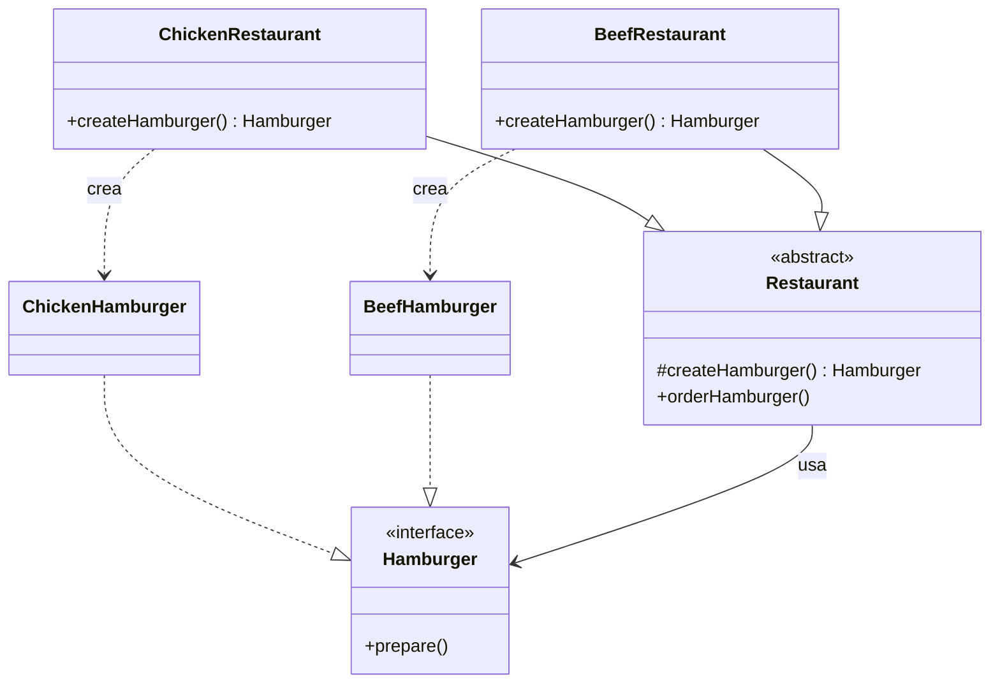
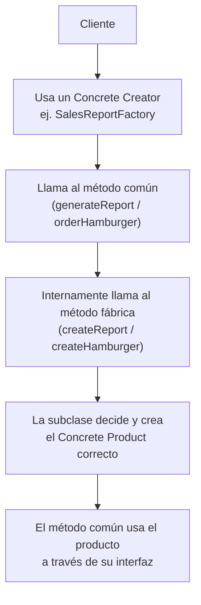

# Factory Method

## 1. Factory Method en una frase

> Factory Method delega **la decisión de qué clase concreta instanciar** a subclases, para que el código cliente trabaje siempre contra una interfaz común sin conocer la clase exacta que recibe.

---

## 2. El problema

Imagina que tienes distintos tipos de hamburguesas:

```ts
interface Hamburger {
  prepare(): void;
}

class ChickenHamburger implements Hamburger {
  prepare() { console.log('Preparando una hamburguesa de pollo'); }
}

class BeefHamburger implements Hamburger {
  prepare() { console.log('Preparando una hamburguesa de res'); }
}
```

Y en tu código cliente decides cuál crear con un `if`/`switch`:

```ts
function ordenar(tipo: string): Hamburger {
  if (tipo === 'chicken') return new ChickenHamburger();
  if (tipo === 'beef') return new BeefHamburger();
  throw new Error('Tipo no soportado');
}
```

Esto funciona... hasta que ese mismo `if`/`switch` se necesita **en varios lugares** del código (el módulo de pedidos, el de facturación, el de reportes de cocina). Ahí aparecen los problemas:

- **Duplicación**: la misma lógica de decisión (`if tipo === 'chicken'...`) se repite en cada lugar que necesita crear una hamburguesa.
- **Acoplamiento fuerte**: el código cliente conoce y depende directamente de **todas** las clases concretas (`ChickenHamburger`, `BeefHamburger`...), en vez de depender solo de la interfaz `Hamburger`.
- **Viola el principio abierto/cerrado**: si agregas un nuevo tipo (`BeanHamburger`), tienes que salir a buscar y modificar **cada** `if`/`switch` repetido por el código.

El problema de fondo no es *usar* un objeto (`Hamburger`), sino **quién decide qué clase concreta crear, y qué tan repartida/duplicada está esa decisión por el código**.

---

## 3. La idea de Factory Method

**Analogía:** una franquicia de restaurantes.

El proceso de "tomar un pedido" es el mismo en cualquier sucursal: el cliente pide, la sucursal prepara, el cliente recibe su hamburguesa. Pero **cada sucursal sabe preparar su propio tipo** de hamburguesa — la de pollo, la de res, la vegetariana — sin que el cliente necesite saber los detalles internos de preparación.

**Técnicamente**, Factory Method aplica la misma idea: defines una clase base (`Restaurant`) con el proceso general (`orderHamburger()`), pero **delegas a las subclases** (`ChickenRestaurant`, `BeefRestaurant`) la decisión de **qué producto concreto crear**, mediante un método que cada subclase implementa a su manera (`createHamburger()`).

El cliente solo interactúa con `Restaurant` y `Hamburger` (interfaces/clases base) — nunca necesita escribir `new ChickenHamburger()` directamente.

---

## 4. Estructura del patrón

| Participante | Rol | En el ejemplo |
|---|---|---|
| **Product** | Interfaz común de lo que se crea | `Hamburger` |
| **Concrete Product** | Implementaciones concretas del producto | `ChickenHamburger`, `BeefHamburger`, `BeanHamburger` |
| **Creator** | Clase base con el "método fábrica" (abstracto) y la lógica común que lo usa | `Restaurant` (declara `createHamburger()` y usa el resultado en `orderHamburger()`) |
| **Concrete Creator** | Implementa el método fábrica decidiendo qué Concrete Product crear | `ChickenRestaurant`, `BeefRestaurant`, `BeanRestaurant` |
| **Client** | Código que usa el `Creator` sin conocer la clase concreta del producto | El código que llama `restaurant.orderHamburger()` |

> **Idea clave:** el `Creator` no sabe (ni le importa) qué `Concrete Product` se está creando — solo sabe que existe un método (`createHamburger()`) que le entrega **algo** que cumple la interfaz `Hamburger`. Esa es la inversión de control característica del patrón: la clase base *usa* algo que las subclases *deciden*.

---

## 5. Diagrama



**En palabras simples:**

Cliente → llama `orderHamburger()` en una subclase concreta de `Restaurant` → esa subclase decide internamente qué `Hamburger` concreta crear → el método común (`orderHamburger`) usa esa hamburguesa sin saber cuál era.

---

## 6. Ejemplo básico

```ts
interface Hamburger {
  prepare(): void;
}

class ChickenHamburger implements Hamburger {
  prepare(): void {
    console.log('Preparando una hamburguesa de pollo');
  }
}

class BeefHamburger implements Hamburger {
  prepare(): void {
    console.log('Preparando una hamburguesa de res');
  }
}

abstract class Restaurant {
  protected abstract createHamburger(): Hamburger;

  orderHamburger(): void {
    const hamburger = this.createHamburger();
    hamburger.prepare();
  }
}

class ChickenRestaurant extends Restaurant {
  override createHamburger(): Hamburger {
    return new ChickenHamburger();
  }
}

class BeefRestaurant extends Restaurant {
  override createHamburger(): Hamburger {
    return new BeefHamburger();
  }
}

const restaurant: Restaurant = new ChickenRestaurant();
restaurant.orderHamburger();
```

**Qué ocurre en cada pieza:**

- `Hamburger` es el **Product**: la interfaz común que le importa al cliente, no las clases concretas.
- `Restaurant` es el **Creator**: define `createHamburger()` como **abstracto** (obliga a cada subclase a implementarlo) y contiene la lógica común `orderHamburger()`, que **no sabe** qué tipo de hamburguesa recibirá.
- Cada subclase (`ChickenRestaurant`, `BeefRestaurant`) es un **Concrete Creator**: solo se encarga de responder "¿cuál producto concreto creo?" — nada más.
- El cliente trabaja con la variable `restaurant` tipada como `Restaurant` (el tipo base), nunca necesita mencionar `ChickenHamburger` directamente.
- Si mañana agregas `BeanRestaurant` + `BeanHamburger`, **no tocas nada de lo existente** — solo agregas una clase nueva. Eso es el principio abierto/cerrado en acción.

---

## 7. Ejemplo más realista

Un caso común en backend: generar distintos tipos de reportes (ventas, inventario) sin llenar el código de `if`/`switch` repetidos.

**Sin Factory Method**, el código tiende a verse así, repetido en cada lugar que necesita un reporte:

```ts
function generarReporte(tipo: string) {
  if (tipo === 'sales') {
    console.log('Generando reporte de ventas...');
    // lógica específica de ventas
  } else if (tipo === 'inventory') {
    console.log('Generando reporte de inventario...');
    // lógica específica de inventario
  } else {
    throw new Error('Tipo de reporte no soportado');
  }
}
```

**Problemas de este enfoque:**

- Si el cron de reportes, el endpoint de la API y el botón de "descargar reporte" en el admin necesitan generar reportes, **cada uno repite este mismo `if`/`else`**.
- Agregar un nuevo tipo de reporte (`ComplianceReport`) implica salir a buscar y tocar cada copia de esa lógica.
- Mezclar la decisión de "qué reporte crear" con la lógica de "cómo se genera cada uno" en una sola función gigante es difícil de testear por partes.

**Con Factory Method:**

```ts
interface Report {
  generate(): void;
}

class SalesReport implements Report {
  generate(): void {
    console.log('Generando reporte de ventas...');
  }
}

class InventoryReport implements Report {
  generate(): void {
    console.log('Generando reporte de inventario...');
  }
}

abstract class ReportFactory {
  protected abstract createReport(): Report;

  generateReport(): void {
    const report = this.createReport();
    report.generate();
  }
}

class SalesReportFactory extends ReportFactory {
  createReport(): Report {
    return new SalesReport();
  }
}

class InventoryReportFactory extends ReportFactory {
  createReport(): Report {
    return new InventoryReport();
  }
}

function crearFabrica(tipo: 'sales' | 'inventory'): ReportFactory {
  return tipo === 'sales' ? new SalesReportFactory() : new InventoryReportFactory();
}

crearFabrica('sales').generateReport();
```

**Qué mejora:**

- La decisión de "qué reporte crear" queda **centralizada en un solo lugar** (`crearFabrica`), en vez de repetida en cada módulo que necesita un reporte.
- `ReportFactory.generateReport()` no sabe ni le importa si generó un `SalesReport` o un `InventoryReport` — solo confía en la interfaz `Report`.
- Agregar `ComplianceReport` es agregar una clase `ComplianceReport` + una `ComplianceReportFactory`, **sin tocar** `SalesReport`, `InventoryReport`, ni `generateReport()`.

---

## 8. Flujo completo



**Paso a paso:**

1. El cliente elige (o recibe) un **Concrete Creator** específico.
2. Llama al método común definido en el `Creator` (`generateReport()`, `orderHamburger()`).
3. Ese método común internamente invoca el **método fábrica** (`createReport()`, `createHamburger()`), que es abstracto en la clase base.
4. La subclase concreta responde ese método fábrica creando el **Concrete Product** que le corresponde.
5. El método común sigue trabajando con el producto **a través de su interfaz** (`Report`, `Hamburger`), sin conocer la clase concreta que recibió.

---

## 9. ¿Cuándo usar Factory Method?

- Una clase **no puede anticipar** de antemano qué tipo exacto de objeto necesitará crear (depende de configuración, entrada del usuario, subclase, etc.).
- Quieres que el código cliente dependa de una **interfaz/clase base**, nunca de clases concretas.
- La lógica de "qué crear" está **duplicada** en varios lugares del código y quieres centralizarla.
- Anticipas que se agregarán **nuevos tipos de producto** con frecuencia, y quieres poder hacerlo sin modificar código existente (abierto/cerrado).

## 10. ¿Cuándo NO usar Factory Method?

Si solo tienes **un tipo de producto** y no hay variantes a futuro, crear toda una jerarquía `Creator`/`Concrete Creator` es sobreingeniería:

```ts
class Hamburger { /* ... */ }

function crearHamburger(): Hamburger {
  return new Hamburger(); // no hay nada que "decidir"
}
```

Tampoco lo necesitas si la decisión de qué crear es simple y estable — a veces basta con una función simple o un mapa de constructores, sin necesidad de herencia:

```ts
const hamburgerFactories: Record<string, () => Hamburger> = {
  chicken: () => new ChickenHamburger(),
  beef: () => new BeefHamburger(),
};

const hamburger = hamburgerFactories['chicken']();
```

Esto es lo que en el repo se explora como **Factory Function** (`07-factory-function.ts`) — un enfoque más ligero, típico de JS/TS, que logra un resultado similar sin construir una jerarquía de clases con herencia. **Regla práctica:** si no necesitas polimorfismo entre distintos `Creator` (con estado o lógica propia por tipo), un mapa de funciones suele ser más simple que Factory Method.

---

## 11. Ventajas y desventajas

| Ventajas | Desventajas |
|---|---|
| Elimina duplicación de lógica de creación repartida en el código | Requiere crear una jerarquía de clases (Creator + subclases) |
| Desacopla al cliente de las clases concretas | Puede ser excesivo si solo hay un tipo de producto o la decisión es simple |
| Cumple el principio abierto/cerrado: agregar tipos no modifica código existente | Añade una capa de indirección que puede complicar seguir el flujo si se abusa |
| Centraliza la decisión de "qué crear" en un solo lugar por tipo de Creator | En TS/JS, a veces una función o un mapa resuelve lo mismo con menos código |

---

## 12. Errores comunes

- **Confundir Factory Method con Abstract Factory**: Factory Method crea **un tipo de producto** (con variantes vía subclases); Abstract Factory crea **familias completas de productos relacionados**. No son el mismo problema.
- **Crear una jerarquía de clases pesada cuando un simple `switch` o mapa de funciones ya resolvía el problema** (ver sección 10).
- **Meter lógica de negocio dentro del método fábrica**: el método fábrica solo debería decidir *qué* instanciar, no ejecutar reglas de negocio complejas.
- **Olvidar la interfaz/clase común del producto**: si `Report`/`Hamburger` no es una interfaz compartida, pierdes el polimorfismo y el patrón deja de tener sentido.
- **Duplicar la lógica de decisión en varios `Concrete Creator`** en vez de que cada uno decida solo su propio caso — si dos fábricas concretas repiten condicionales entre sí, probablemente falta una fábrica intermedia o un mapa.

---

## 13. Factory Method vs otros patrones creacionales

**Factory Method vs Builder** (ver [builder.md](builder.md)):

- **Factory Method** responde: **¿qué clase concreta instanciar?**
- **Builder** responde: **¿cómo ensamblar, paso a paso, un objeto complejo (casi siempre del mismo tipo)?**

```ts
// Factory Method: decide QUÉ clase crear
const hamburger = restaurant.orderHamburger(); // internamente decide chicken/beef/bean

// Builder: decide CÓMO ensamblar un mismo tipo de objeto complejo
const computer = new ComputerBuilder().setCPU('i9').setRAM('32GB').build();
```

**Factory Method vs Abstract Factory** (adelanto, se profundiza en su propia guía):

- **Factory Method** crea **un producto** por subclase (una hamburguesa).
- **Abstract Factory** crea **una familia completa de productos relacionados** por subclase (por ejemplo: hamburguesa + bebida + postre, todos coordinados para el mismo "combo").

Una forma de verlo: Abstract Factory suele estar compuesto internamente por **varios** Factory Methods, uno por cada producto de la familia.

---

## 14. Resumen para estudiar

**Factory Method**

- **Problema** → Lógica de "qué clase concreta crear" duplicada en el código y acoplada a clases concretas.
- **Solución** → Delegar la creación a subclases mediante un método fábrica que cada una implementa a su manera.
- **Idea principal** → La clase base define el proceso común; las subclases deciden qué producto concreto se usa en ese proceso.
- **Cuándo usar** → No se puede anticipar el tipo exacto a crear, o esa decisión está repetida/dispersa en el código.
- **Cuándo evitar** → Un solo tipo de producto, o la decisión es simple y estable (ahí un mapa de funciones basta).
- **Método característico** → un método abstracto tipo `createX()`, siempre invocado desde otro método concreto de la misma clase base.

### Preguntas de autoevaluación

1. ¿Por qué `Restaurant.orderHamburger()` no necesita saber qué tipo de hamburguesa se creó?
2. ¿Qué principio SOLID se refuerza directamente cuando agregas un nuevo tipo de producto sin tocar código existente?
3. Da un ejemplo (propio, no del documento) de un caso donde un simple `Record<string, () => Producto>` sería mejor que crear toda la jerarquía de Factory Method.
4. ¿Cuál es la diferencia principal entre Factory Method y Abstract Factory?
5. En el ejemplo de reportes (sección 7), ¿qué tendrías que tocar para agregar un `ComplianceReport`? ¿Y qué NO tendrías que tocar?
