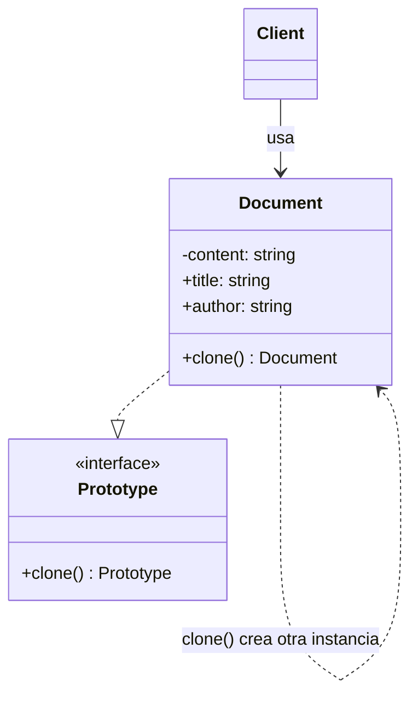
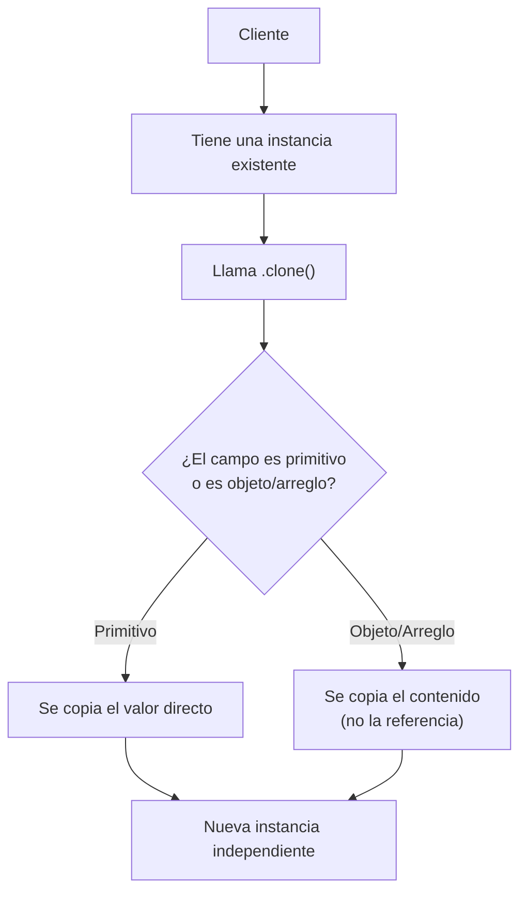

# Prototype

## 1. Prototype en una frase

> Prototype crea objetos nuevos **copiando una instancia existente** en vez de construirla desde cero, sin que el código cliente dependa de su clase concreta.

---

## 2. El problema

Imagina esta clase:

```ts
class Document {
  public title: string;
  private content: string; // <- privado a propósito
  public author: string;

  constructor(title: string, content: string, author: string) {
    this.title = title;
    this.content = content;
    this.author = author;
  }

  displayInfo() { /* ... */ }
}
```

Tienes un `document1` ya creado y quieres una copia casi idéntica (misma cotización, mismo autor) pero con el título cambiado. Tu primer instinto sería reconstruirlo manualmente desde fuera:

```ts
const document2 = new Document(
  'Nueva cotización',
  document1.content, // <- Error de compilación: 'content' es privado
  document1.author
);
```

Esto **ni siquiera compila**: `content` es `private`, así que el código cliente no puede leerlo para volver a pasarlo al constructor. Y aunque todos los campos fueran públicos, seguirías teniendo problemas:

- **Tienes que conocer y repetir todos los valores** del objeto original, aunque el 90% sea idéntico.
- **Rompes la encapsulación** si haces los campos públicos solo para poder copiarlos desde fuera.
- Si el objeto es costoso de construir (cálculos pesados, datos cargados de un archivo, valores derivados), **reconstruirlo desde cero desperdicia trabajo** que ya se hizo una vez.

El problema de fondo no es "crear un objeto" — es **crear un objeto casi igual a otro que ya existe**, sin poder (o sin querer) acceder a todos sus detalles internos desde fuera.

---

## 3. La idea de Prototype

**Analogía:** una fotocopiadora.

Si ya tienes un formulario lleno (nombre, fecha, firma), no vuelves a escribir todo desde una hoja en blanco para hacer una variante — **sacas una fotocopia** y solo tachas/cambias el campo que necesitas. La fotocopia parte de algo ya completo, no de cero.

**Técnicamente**, Prototype aplica la misma idea: el propio objeto sabe copiarse a sí mismo mediante un método `clone()`. Como `clone()` vive **dentro** de la clase, sí tiene acceso a los campos privados (`content`), y puede construir la copia sin que el cliente necesite conocer ni un solo detalle interno.

```ts
const document2 = document1.clone(); // fotocopia completa
document2.title = 'Nueva cotización'; // solo cambias lo que necesitas
```

---

## 4. Estructura del patrón

| Participante | Rol | En el ejemplo |
|---|---|---|
| **Prototype** | Interfaz (o clase) que declara el método `clone()` | Podría ser una interfaz `Cloneable<T> { clone(): T }` |
| **Concrete Prototype** | Implementa `clone()` devolviendo una copia de sí mismo | `Document`, `Pokemon` |
| **Client** | Pide copias llamando `.clone()`, sin usar `new` ni conocer los detalles internos | El código que llama `document1.clone()` |

> **A diferencia de Builder, Factory Method y Abstract Factory, Prototype casi nunca necesita una clase "creadora" aparte.** El propio objeto es responsable de clonarse — no hay `Director`, ni `Creator`, ni fábrica externa. Es, de los patrones creacionales vistos hasta ahora, el más simple en cuanto a número de piezas.

---

## 5. Diagrama



**En palabras simples:**

Cliente → tiene una instancia existente → le llama `.clone()` → recibe una instancia **nueva** e **independiente**, con los mismos valores → modifica solo lo que necesita en la copia, sin afectar al original.

---

## 6. Ejemplo básico

```ts
class Document {
  public title: string;
  private content: string;
  public author: string;

  constructor(title: string, content: string, author: string) {
    this.title = title;
    this.content = content;
    this.author = author;
  }

  clone(): Document {
    return new Document(this.title, this.content, this.author);
  }

  displayInfo() {
    console.log(`Title: ${this.title}\nContent: ${this.content}\nAuthor: ${this.author}`);
  }
}

const document1 = new Document('Cotización', '500 dólares', 'Fernando');

const document2 = document1.clone();
document2.title = 'Nueva cotización';

document1.displayInfo(); // sigue diciendo "Cotización"
document2.displayInfo(); // dice "Nueva cotización"
```

**Qué ocurre en cada pieza:**

- `clone()` está **dentro** de `Document`, así que sí puede leer `this.content` (privado) sin romper la encapsulación — nadie fuera de la clase necesita acceder a ese campo.
- `clone()` construye una instancia **completamente nueva** (`new Document(...)`) — `document2` no es una referencia a `document1`, es un objeto distinto en memoria.
- Modificar `document2.title` **no afecta** a `document1` — son independientes desde el momento en que se clonan.
- El cliente nunca escribió `new Document(...)` con todos los parámetros a mano — solo llamó `.clone()` y ajustó lo que le interesaba.

---

## 7. Ejemplo más realista — y el bug más común de Prototype

Ahora con `Pokemon`, que tiene un campo más delicado: un arreglo (`attacks`).

```ts
class Pokemon {
  constructor(
    public name: string,
    public type: string,
    public level: number,
    public attacks: string[]
  ) {}

  clone(): Pokemon {
    return new Pokemon(this.name, this.type, this.level, [...this.attacks]);
  }

  displayInfo(): void {
    console.log(`Nombre: ${this.name}\nNivel: ${this.level}\nAtaques: ${this.attacks.join(', ')}`);
  }
}
```

**¿Por qué `[...this.attacks]` y no simplemente `this.attacks`?** Aquí está el error más común al implementar Prototype — vale la pena verlo fallar primero:

```ts
// Clon "ingenuo": parece que copia todo, pero NO
class PokemonConBug {
  clone(): Pokemon {
    return new Pokemon(this.name, this.type, this.level, this.attacks); // <- mismo arreglo
  }
}

const base = new Pokemon('Charmander', 'Fuego', 1, ['Arañazo']);
const clon = base.clone();

clon.attacks.push('Lanzallamas');

console.log(base.attacks); // ['Arañazo', 'Lanzallamas']  <- ¡se modificó el original!
```

Esto pasa porque en JS/TS los arreglos y objetos se copian **por referencia**. Si le pasas `this.attacks` directo (sin `[...]`), el clon y el original **apuntan al mismo arreglo en memoria** — es una **copia superficial (shallow copy)**: los campos primitivos (`name`, `level`) sí se copian de verdad, pero los campos que son objetos/arreglos siguen compartidos.

`[...this.attacks]` crea un **arreglo nuevo** con los mismos elementos — eso sí es independiente del original. Esto se llama **copia profunda (deep copy)** de ese campo.

**Regla práctica:** cada vez que implementes `clone()`, pregúntate campo por campo: *¿esto es un primitivo (string, number, boolean) o es un objeto/arreglo?* Los primitivos se copian solos; los objetos/arreglos necesitan copiarse explícitamente (`[...arr]`, `{...obj}`, o una copia profunda recursiva si están anidados varios niveles).

---

## 8. Flujo completo



**Paso a paso:**

1. El cliente ya tiene una instancia (el "prototipo") de la que quiere partir.
2. Llama `.clone()` en vez de `new ClaseX(...)`.
3. Dentro de `clone()`, cada campo primitivo se copia por valor automáticamente; cada campo objeto/arreglo debe copiarse explícitamente para no compartir referencia.
4. El cliente recibe una instancia nueva, independiente del original, lista para modificar sin efectos secundarios.

---

## 9. ¿Cuándo usar Prototype?

- Crear el objeto desde cero es **costoso** (cálculos pesados, datos cargados de disco/red) y ya tienes una instancia similar de la cual partir.
- Necesitas generar **muchas variantes** de un objeto base con pequeños cambios (como los Pokémon evolucionados, o plantillas de configuración por cliente/tenant).
- El objeto tiene **campos privados o encapsulados** que el código cliente no debería (o no puede) conocer para reconstruirlo manualmente.
- Quieres que el cliente dependa solo de una interfaz `clone()`, sin acoplarse a la clase concreta del objeto que copia.

## 10. ¿Cuándo NO usar Prototype?

Si el objeto es simple, barato de construir, y no tiene estado interno delicado, clonar no aporta nada sobre usar `new` directamente:

```ts
class Point {
  constructor(public x: number, public y: number) {}
}

new Point(3, 4); // ya es igual de simple que hacer point.clone()
```

Ten cuidado también con objetos que tienen **referencias circulares** o conexiones a recursos externos (sockets, conexiones de base de datos, streams abiertos): clonarlos correctamente puede ser complicado o directamente no tener sentido — no querrías dos objetos compartiendo (o duplicando) la misma conexión de red.

---

## 11. Ventajas y desventajas

| Ventajas | Desventajas |
|---|---|
| Evita reconstruir desde cero objetos costosos de crear | Clonar estructuras profundamente anidadas puede ser complejo de implementar bien |
| Permite copiar objetos con campos privados sin romper encapsulación | Riesgo real de bugs sutiles por confundir copia superficial con copia profunda |
| Reduce el acoplamiento a clases concretas (el cliente solo usa `clone()`) | Objetos con referencias circulares complican (o impiden) un `clone()` correcto |
| Útil para generar variantes/plantillas a partir de una base | No aporta nada si el objeto ya es simple y barato de construir |

---

## 12. Errores comunes

- **Confundir copia superficial con copia profunda** — el bug que vimos en la sección 7 (`this.attacks` en vez de `[...this.attacks]`) es, por lejos, el error más común al implementar Prototype.
- **Usar `{ ...obj }` o `Object.assign({}, obj)` como si fuera un clon seguro**, sin revisar si `obj` tiene propiedades anidadas (arreglos, objetos, `Date`, `Map`) que seguirán compartidas por referencia.
- **Olvidar que `clone()` debe vivir dentro de la clase** — si lo intentas hacer desde fuera reconstruyendo el objeto manualmente, chocas con los campos privados (como vimos en la sección 2).
- **Clonar recursos externos** (conexiones, sockets, file handles) como si fueran datos — normalmente esos campos no deberían clonarse, sino compartirse o volver a crearse aparte.
- **No copiar profundamente cuando hay varios niveles de anidación** — `[...arr]` o `{...obj}` solo copian **un nivel**; si dentro hay otro objeto/arreglo, ese nivel interno sigue compartido a menos que también lo copies explícitamente (o uses una utilidad de deep clone).

---

## 13. Prototype vs otros patrones creacionales

**Prototype vs Factory Method / Abstract Factory** (ver [factory-method.md](factory-method.md) y [abstract-factory.md](abstract-factory.md)):

- **Factory Method / Abstract Factory** crean objetos **nuevos desde cero** — no necesitan ninguna instancia previa, solo deciden qué clase concreta instanciar.
- **Prototype** crea objetos **a partir de una instancia ya existente** — la pregunta no es "¿qué clase creo?", sino "¿de cuál objeto ya armado parto?".

**Prototype vs Builder** (ver [builder.md](builder.md)):

- **Builder** ensambla un objeto complejo **paso a paso, desde cero**, siguiendo una secuencia de configuración.
- **Prototype** parte de un objeto **ya completamente armado** y lo copia de una sola vez — no hay pasos, hay una copia.
- Se pueden combinar: clonas un prototipo como base y luego usas setters (o un builder) para ajustar solo lo que cambia en la copia.

---

## 14. Resumen para estudiar

**Prototype**

- **Problema** → Reconstruir un objeto casi idéntico a otro ya existente es costoso, repetitivo, y a veces imposible si tiene campos privados.
- **Solución** → El objeto se copia a sí mismo mediante un método `clone()` que vive dentro de la clase.
- **Idea principal** → Partir de una instancia ya armada en vez de construir desde cero.
- **Cuándo usar** → Construcción costosa, necesidad de muchas variantes de una base, o campos privados que impiden reconstruir desde fuera.
- **Cuándo evitar** → Objetos simples y baratos de crear, o con referencias/recursos externos difíciles de clonar.
- **Método característico** → `clone()`

### Preguntas de autoevaluación

1. ¿Por qué `new Document(doc.title, doc.content, doc.author)` no compila si `content` es `private`, y cómo lo resuelve `clone()`?
2. ¿Qué diferencia hay entre `return new Pokemon(this.name, this.type, this.level, this.attacks)` y `return new Pokemon(this.name, this.type, this.level, [...this.attacks])`? ¿Cuál es la superficial y cuál la profunda?
3. Si `Pokemon` tuviera un campo `entrenador: { nombre: string, medallas: string[] }`, ¿qué tendrías que hacer en `clone()` para copiarlo correctamente en todos sus niveles?
4. ¿Cuál es la diferencia principal entre Prototype y Factory Method, en cuanto al punto de partida de la creación?
5. Da un ejemplo propio (no del documento) de un objeto costoso de construir donde Prototype ahorraría trabajo real.
